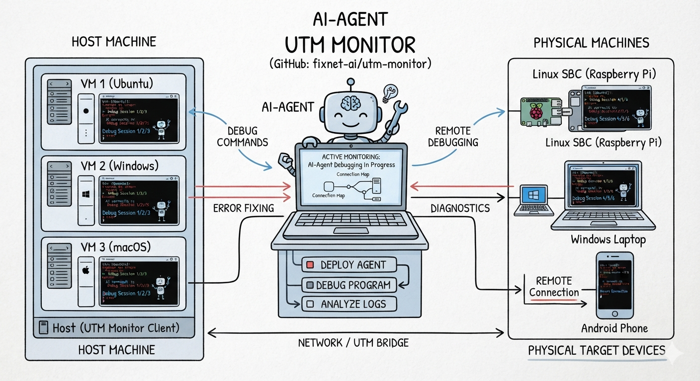

# UTM Monitor



**Remote debugging sidekick — VMs and physical machines, one command away.**

Single Zig binary, dual mode (Guest agent + Host controller). Check processes,
read logs, transfer files on any machine — Linux, macOS, Windows. No SSH daemon
required at runtime. AI agents get the same capabilities through HTTP MCP.

## MCP Integration

`utmm --mcp` prints the HTTP endpoint URL and ensures the Host daemon is running.
Seven tools available via HTTP POST to `http://127.0.0.1:2121/` (JSON-RPC 2.0):

| Tool | Description |
|------|-------------|
| `status` | List all nodes: hostname, role, IP, OS/arch, MAC, version, status, shell, ConPTY |
| `exec` | Execute a shell command on any Guest via per-command pty |
| `ping` | Ping a Guest over the mesh network and measure RTT |
| `upload` | Upload file from Host to Guest (TCP/SOCKS5, SHA256 verified) |
| `download` | Download file from Guest to Host (TCP/SOCKS5, SHA256 verified) |
| `sshpass` | Non-interactive SSH password auth — direct shell access to any machine |
| `manual` | Return the full reference manual (this document embedded at compile time) |

Example prompts your AI agent can handle:
- "Push the new build to linuxvm and run the test suite — show me the failures"
- "linuxvm just crashed. Grab the system logs and core dump, find the root cause"
- "This binary works on Linux but panics on Windows — run it on both and compare"
- "Can windowsvm reach linuxvm on port 3000? Diagnose what's blocking it"
- "Attach lldb to myapp on macvm, set a breakpoint, and show the backtrace"
- "Install zig 0.16.0 on all Linux VMs and verify the version"

See [MANUAL.md](MANUAL.md#mcp-protocol) for the full MCP protocol reference
(message format, request/response examples).

## Core Capabilities

- **Streaming exec** — run commands on any machine with real-time pty output,
  exit code, no timeout.
- **File transfer** — upload/download with SHA256 verification and atomic writes.
- **SOCKS5 mesh forwarding** — Host acts as SOCKS5 proxy to every Guest on TCP :2121.
  Reach any Guest's services from the Host — no SSH tunnels, no port mapping.
  **Windows: disable firewall** for BIND + UDP ASSOCIATE (dynamic ports).
- **sshpass built-in** — non-interactive SSH password auth, 100% CLI-compatible
  with standalone `sshpass`. POSIX PTY + Windows ConPTY (dynamic load, pipe
  fallback on older Windows).
- **LSA mesh zero-config** — Guests auto-discover Host over the local network,
  `/etc/hosts` kept in sync automatically.
- **MCP HTTP** — AI agents get seven tools (`status`, `exec`, `ping`, `upload`,
  `download`, `sshpass`, `manual`) via HTTP POST to Host's TCP :2121. First-byte
  protocol dispatch: 0x05→SOCKS5, ASCII→HTTP MCP. `utmm --mcp` prints the endpoint
  URL and auto-ensures Host — no separate process, no IPC bridge, no idle timeout.

## Architecture

```
                         ┌── HTTP MCP ← AI Agent (POST to :2121)
Guest (macvm)    ──TCP──┐
Guest (linuxvm)  ──TCP──┤──→ Host TCP :2121 ──┼── CLI (IPC)
Guest (windows)  ──TCP──┘   (SOCKS5 + HTTP MCP
                         │    via first-byte)
Guest ←── LSA broadcast (UDP :2121) ──┘  (auto-discovery + topology)

Host TCP :2121 = SOCKS5 proxy + HTTP MCP on a single port. Reach any Guest's
services from the Host. AI agents use HTTP POST for MCP JSON-RPC.
```

## CLI Quick Start

```bash
# Check health across all machines
utmm --status      # Host + all Guests: hostname, role, IP, target, version, status, shell, ConPTY

# Execute commands on any Guest (pty shell, streaming output)
utmm --exec linuxvm "ps aux | grep myapp"
utmm --exec macvm "tail -50 /var/log/system.log"
utmm --exec windowsvm "tasklist | findstr myapp"

# File transfer
utmm --upload build.zip linuxvm
utmm --download linuxvm /var/log/app.log ./app.log

# Non-interactive SSH (built-in sshpass)
utmm sshpass -p '111' ssh root@linuxvm 'uname -a'
utmm sshpass -f ~/.ssh/pass ssh user@server 'uptime'      # password from file
utmm sshpass -e ssh admin@host 'cmd'                        # password from SSHPASS env

# Push upgrade to Guest
utmm --upgrade linuxvm

# One-shot deploy to all machines
utmm --deploy
utmm --deploy linuxvm

# Mesh ping
utmm --ping linuxvm

# SOCKS5 forwarding — reach any Guest's services from the Host
curl --socks5 localhost:2121 http://linuxvm:8080            # web server on linuxvm
curl --socks5 localhost:2121 http://windowsvm:3389          # RDP on windowsvm
# From a Guest, use the Host's gateway hostname:
#   curl --socks5 gateway:2121 http://linuxvm:8080
```

> **ConPTY**: On Windows, `--status` shows `conpty:yes/no` for each node.
> Windows < 10.0.17763 lacks the ConPTY API — sshpass falls back to pipe mode.
> POSIX always reports `conpty:yes`. This is critical for MCP SSH operations.


## Install

Download the latest `utmm.zip` from [GitHub Releases](https://github.com/fixnet-ai/utm-monitor/releases),
unzip, and run `--install`:

```bash
# POSIX (Linux/macOS)
unzip utmm.zip
sudo ./utmm-<target>-<version> --install --hostname <name>

# Windows (PowerShell as Administrator)
Expand-Archive utmm.zip
C:\opt\utmm\utmm-<target>-<version>.exe --install --hostname <name>
```

Install is a single atomic operation: stop → kill → copy to canonical path →
install system service → start. No shell scripts, no package managers.

## Build

```bash
zig build                          # Native debug build → zig-out/bin/utmm
zig build -Doptimize=ReleaseSafe   # ReleaseSafe
zig build test                     # Unit tests
zig build test-integration         # Integration tests

# Cross-compile (ReleaseSafe required for deployment)
zig build -Doptimize=ReleaseSafe -Dtarget=aarch64-linux-musl
zig build -Doptimize=ReleaseSafe -Dtarget=aarch64-macos
zig build -Doptimize=ReleaseSafe -Dtarget=aarch64-windows
# ... plus x86_64 variants for all three platforms (6 targets total)
```

**Requirements**: Zig 0.16.0, macOS build host (other hosts may work, untested).

### Build Prerequisites

The `build.zig.zon` references zio as a local-path dependency (`../zio`).
Before building, clone the zio fork with x86-32 support:

```bash
git clone https://github.com/fixnet-ai/zio.git ../zio
cd ../zio && git checkout feat/x86-32
```

This is temporary — once the x86-32 PR is merged upstream, the dependency will
switch to a URL and Zig's package manager will fetch it automatically.

## Full Reference

See [MANUAL.md](MANUAL.md) for the complete CLI reference, MCP protocol
messages, architecture deep-dive, platform differences, and deployment guide.

## Acknowledgments

UTM Monitor builds on excellent open-source projects:

- **[zio](https://github.com/lalinsky/zio)** — High-performance async I/O framework for Zig.
  Powers all event-driven networking (TCP/UDP, timers, coroutines, IOCP/kqueue/epoll).
- **[OpenSSH](https://www.openssh.com/)** — The gold standard for secure remote access.
  Embedded `ssh.exe` (Windows) enables zero-dependency `sshpass` on all platforms.

Thanks to the maintainers and contributors of these projects.
